# CLAUDE.md — Spring AI Alibaba Admin

## 项目定位

Spring AI Alibaba Admin 是一个 **AI Agent 全生命周期管理平台**，基于 Spring AI Alibaba 构建。覆盖 Prompt 工程、数据集管理、评估器配置、实验执行、可观测性分析、MCP 服务管理等完整工作流。支持可视化 Agent 开发、调试、发布和 DSL 导入导出。

- 上游框架：[Spring AI Alibaba](https://github.com/alibaba/spring-ai-alibaba)
- 文档站点：https://java2ai.com
- 技术栈：Spring Boot 3.3.6 + Spring AI 1.1.2 + JDK 17

## 核心架构



**五层结构**：前端 → Admin 平台 → 核心框架 → Starter 接入层 → 中间件/外部服务

- **前端**：Admin Frontend（可视化开发平台）+ Studio UI（嵌入式调试界面）
- **Admin 平台**：4 个子模块，提供 REST API（212 个接口）
- **核心框架**：Agent Framework（多智能体编排）+ Graph Core（状态机引擎）
- **中间件**：MySQL + Redis + Elasticsearch + Nacos + RocketMQ
- **外部服务**：DashScope / OpenAI / DeepSeek + OpenTelemetry

> 详细架构图 → [docs/architecture.svg](docs/architecture.svg)
> 接口清单 → [docs/api-list.md](docs/api-list.md)
> 数据模型 → [docs/data-model.md](docs/data-model.md)
> ER 图 → [docs/data-model-er.svg](docs/data-model-er.svg)
> 模块依赖 → [docs/module-deps.svg](docs/module-deps.svg)
> 外部依赖 → [docs/external-deps.svg](docs/external-deps.svg)

## 关键模块

### 后端 4 个子模块

| 模块 | 职责 |
|------|------|
| `admin-server-runtime` | 运行时基础模型与工具类，无内部依赖（叶子节点） |
| `admin-server-core` | 核心业务逻辑，依赖 runtime |
| `admin-server-openapi` | 对外 OpenAPI 接口定义（Agent 对话、工作流执行） |
| `admin-server-start` | 应用启动入口，集成所有模块，包含 Controller 和 Entity |

### 模块依赖链

```
admin-server-start → admin-server-core → admin-server-runtime
admin-server-start → admin-server-openapi → admin-server-core
admin-server-start → graph-core
```

> 无循环依赖。

### 业务域划分

| 域 | 核心实体 | 说明 |
|----|---------|------|
| Prompt | prompt, prompt_version | Prompt 模板版本化管理 |
| Dataset | dataset, dataset_version, dataset_item | 评估数据集 |
| Evaluator | evaluator, evaluator_version | 评估器配置与执行 |
| Experiment | experiment, experiment_result | 实验编排与结果分析 |
| Platform | account, workspace, application, plugin, tool | 平台基础管理 |
| Knowledge | knowledge_base, document | RAG 知识库 |
| Model | provider, model, model_config | 模型提供商与配置 |
| MCP | mcp_server | MCP 服务器管理 |
| Agent | agent_schema | Agent 配置（五种类型） |

> 完整数据模型 → [docs/data-model.md](docs/data-model.md)

## 关键约定

### 编码规范

- **JDK 17**，鼓励 records、switch expressions、text blocks
- **Lombok** 减少样板代码（`@Data`, `@Builder`, `@Slf4j`）
- **SLF4J** 日志，禁止 `System.out.println`
- **Apache 2.0** License Header 必须
- Entity 用 `@Data @Builder`，Controller 用 `@RestController @RequiredArgsConstructor`

### 版本管理

- 根 pom 通过 `<dependencyManagement>` 统一锁版本
- 子模块不单独声明外部依赖版本
- 注意：admin 的 Spring Boot 版本（3.3.6）与上游根 pom（3.5.8）不同

### 数据库

- 两套 Schema：`admin-schema.sql`（评估业务）+ `agentscope-schema.sql`（平台基础）
- MyBatis Plus 做 ORM，Mapper XML 在 `resources/mapper/`
- 核心实体采用「主表 + 版本表」1:N 模式
- 灵活结构用 LONGTEXT/JSON 存储，应用层解析

### API 风格

- 管理接口前缀：`/console/v1/*`
- 核心业务前缀：`/api/*`
- 对外 OpenAPI：`/api/v1/apps/*`
- Graph Studio：`graph-studio/api/*`
- 返回统一用 `Result<T>` 或 `PageResult<T>` 信封

## 怎么跑

### 环境要求

- JDK 17+
- Maven 3.8+
- Docker + Docker Compose 2.0+（中间件）

### 快速启动

```bash
# 1. 启动中间件（MySQL + Redis + ES + Nacos + RocketMQ）
cd docker/middleware && docker compose -f docker-compose-prod.yaml up -d

# 2. 配置模型 API Key
# 编辑 spring-ai-alibaba-admin-server-start/model-config-dashscope.yaml
# 设置 DASHSCOPE_API_KEY 环境变量

# 3. 启动应用
cd spring-ai-alibaba-admin
./mvnw -pl spring-ai-alibaba-admin-server-start spring-boot:run

# 4. 访问
# 前端：http://localhost:8080
# API Docs：http://localhost:8080/swagger-ui.html
# 健康检查：http://localhost:8080/console/v1/system/health
```

### Docker 一键部署

```bash
cd deploy/docker-compose && docker compose up -d
```

### 常用命令

```bash
# 构建（跳过测试）
./mvnw -B package -DskipTests=true

# 构建单个模块
./mvnw -pl :spring-ai-alibaba-admin-server-core -B package -DskipTests=true

# 运行测试
./mvnw test

# Lint
make codespell
make yaml-lint
make licenses-check
```

## 禁区

> **待补充** — 以下场景需要特别谨慎或禁止操作：

- [ ] 禁止在未确认影响的情况下修改 `admin-server-runtime` 的公共 API（所有上层模块依赖它）
- [ ] 禁止硬编码 API Key、数据库密码等敏感信息
- [ ] 禁止直接修改 `docker/middleware/init/mysql/` 下的 SQL（应通过 Flyway 或增量脚本）
- [ ] 禁止在 Controller 层写业务逻辑（保持薄 Controller）
- [ ] ...

## 历史包袱

> **待补充** — 已知的技术债务和遗留问题：

- [ ] Spring Boot 版本不一致：admin 用 3.3.6，上游根 pom 用 3.5.8
- [ ] Fastjson 1.x 和 2.x 共存（1.2.83 在 agent-framework，2.0.58 在 admin-server-start）
- [ ] Redisson 版本不一致：root 3.22.0 vs admin 3.27.2
- [ ] MySQL Connector 版本不一致：8.0.33 vs 9.2.0
- [ ] Nacos Client 版本不一致：3.0.3 vs 3.1.0
- [ ] `dataset_item.deleted` 字段在 Entity 中有但建表 SQL 中缺少（agentscope-schema 的 dataset_item 无 deleted）
- [ ] ...
